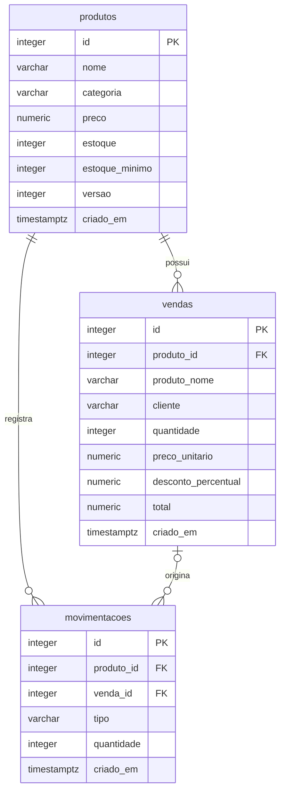

# Banco de dados

## Modelo



Uma movimentação pode não ter venda, como a entrada inicial ou um ajuste. Uma venda criada pela Procedure gera uma movimentação de saída. A chave estrangeira permite a relação, enquanto a Procedure executa o processo completo.

`controle_banco` é uma tabela técnica com o nome da instalação aplicada e sua data. Ela impede repetir os dados de exemplo quando a aplicação reinicia.

## Caminho de cada funcionalidade

```text
Orçamento
  formulário -> POST /api/orcamento -> SELECT calcular_total(...) -> total na tela

Nova venda
  formulário -> POST /api/vendas -> CALL registrar_venda(...)
             -> INSERT vendas + UPDATE produtos + INSERT movimentacoes
             -> confirmação na tela

Relatório
  tela -> GET /api/relatorio -> SELECT ... FROM relatorio_vendas
       -> histórico e indicadores na tela
```

As chamadas estão em `src/rotas.js`. A conexão está em `src/banco.js`. Os formulários chamam as rotas por `fetch`, em `src/publico/script.js`.

## Por que cada recurso existe

**Function:** centraliza o cálculo do valor com desconto. Um orçamento e uma venda seguem a mesma regra. Retorna um valor e não altera dados.

**Procedure:** representa o processo de venda, que envolve várias alterações relacionadas. Mantém a atualização do estoque junto com o registro da venda e da saída.

**View:** reúne os campos usados pelo relatório e simplifica as consultas da aplicação. É uma consulta armazenada; não é uma cópia independente dos dados.

## Consistência

A Procedure bloqueia a linha do produto com `SELECT ... FOR UPDATE`. Em um servidor PostgreSQL, uma segunda venda do mesmo produto espera a primeira finalizar e então confere o novo saldo. No modo embarcado, o PGlite serializa as transações de sua conexão única. O teste de requisições simultâneas valida esse modo local; não substitui um teste com várias conexões de um servidor.

Preço e nome são copiados para a venda intencionalmente: o comprovante histórico não deve mudar quando o catálogo for editado. O total também fica registrado. Valores em dinheiro usam `NUMERIC`, e o arredondamento acontece apenas no resultado do cálculo.

A versão do produto aumenta a cada venda ou edição. Se alguém abrir o formulário de edição e o estoque mudar antes de salvar, a aplicação pede a atualização dos dados.

A chave estrangeira em `vendas.produto_id` impede excluir um produto vendido. Movimentações de um produto nunca vendido são removidas junto com o produto.

## Consultas para demonstrar

Execute no banco de apresentação. A chamada da Procedure abaixo faz uma venda real.

```sql
-- Listar os produtos e saldos.
SELECT id, nome, preco, estoque FROM produtos ORDER BY id;

-- Calcular sem alterar os dados: resultado esperado 44.82.
SELECT calcular_total(24.90, 2, 10);

-- Conferir o relatório que a tela utiliza.
SELECT * FROM relatorio_vendas ORDER BY venda_id DESC;

-- Conferir saídas e ajustes.
SELECT * FROM movimentacoes ORDER BY id DESC;

-- Confirmar os tipos dos objetos: f = function, p = procedure.
SELECT proname, prokind FROM pg_proc
WHERE proname IN ('calcular_total', 'registrar_venda');

-- Verificar a definição da View no PostgreSQL.
SELECT pg_get_viewdef('relatorio_vendas'::regclass, true);
```

No modo embarcado, não há porta de conexão para pgAdmin. É possível demonstrar os scripts no editor, as requisições na aba Rede do navegador e os testes com `npm test`. Para usar um cliente SQL externo, escolha o modo com servidor PostgreSQL do README.
